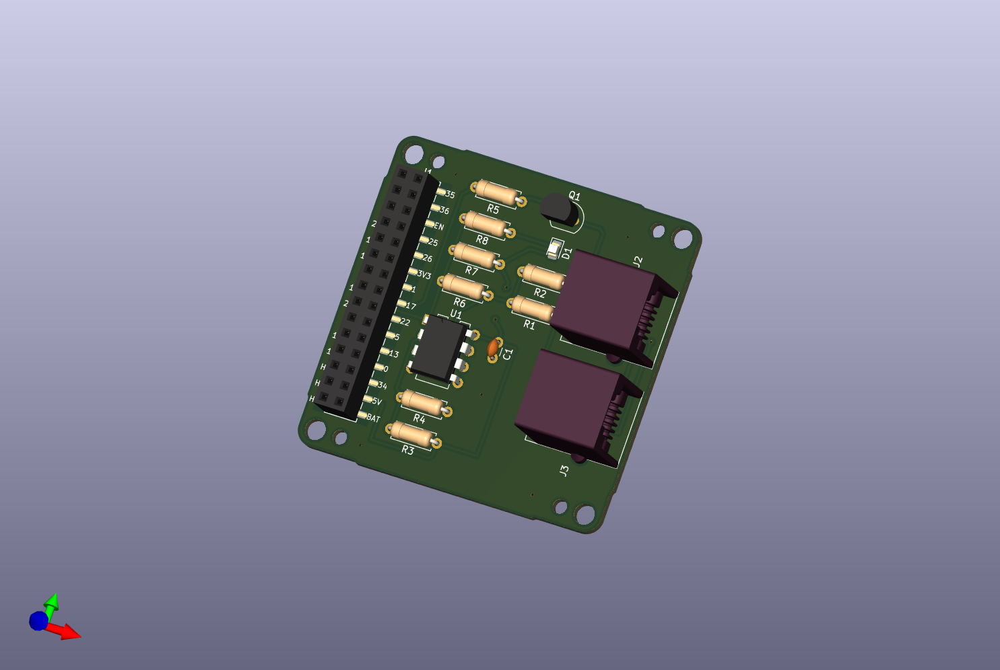

# KiCad-M5StackLocoNetModule

KiCad6 project files for M5Stack LocoNet Module

## Description

This repositorhy contains KiCad6 project files for M5Stack LocoNet Module.
M5Stack LocoNet Module has a LocoNet interface to send and receive LocoNet messages.

### Artifacts

- [Schematic](./artifacts/M5StackLocoNetModule-schematic.pdf)
- [BOM](https://htmlview.glitch.me/?https://github.com/kgh02017/KiCad-M5StackLocoNetModule/blob/main/project/M5StackLocoNetModule/bom/M5StackLocoNetModule.html)

## Arthor

Taku Izumi
